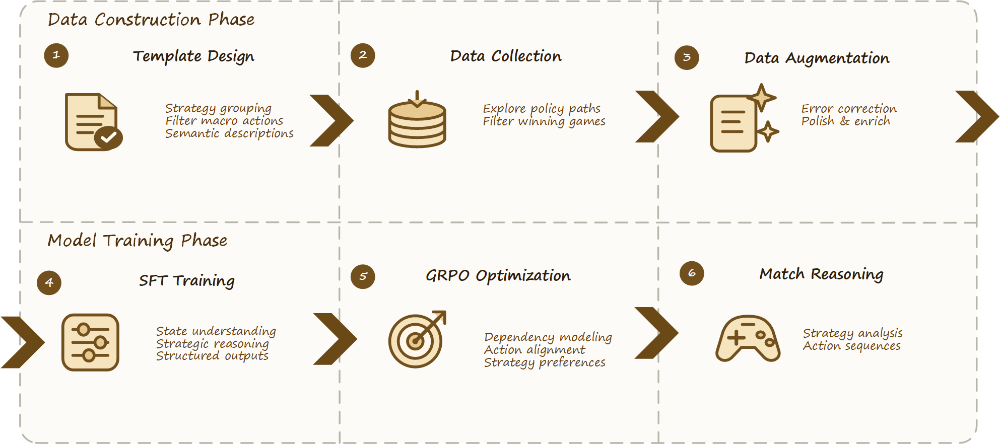
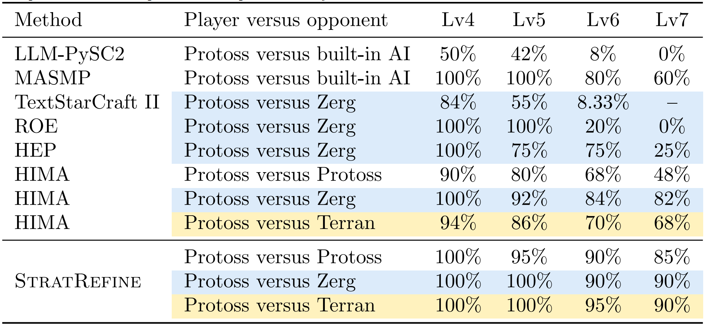
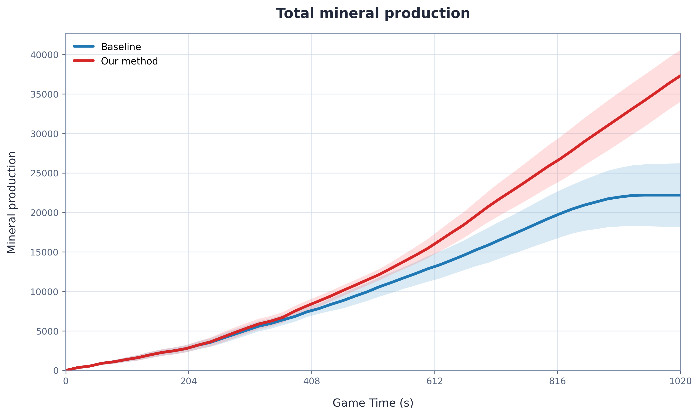
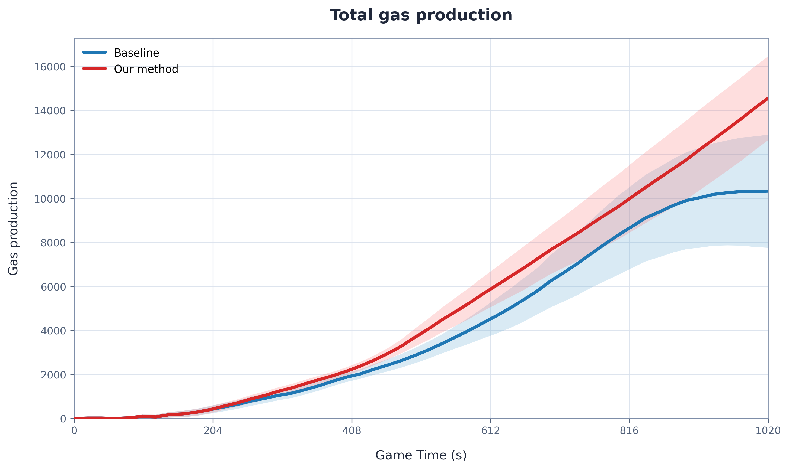
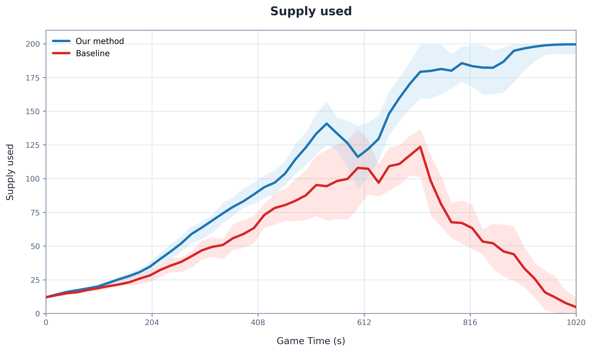
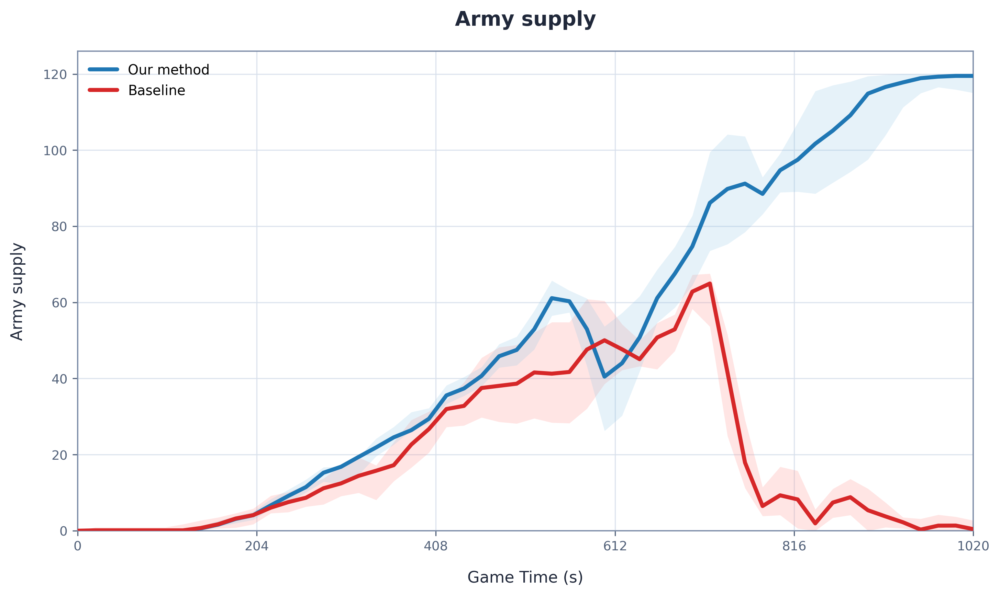

# StratRefine

> **Enhancing Strategic Reasoning and Action Generation in LLM Agents for StarCraft II**  
> 面向《星际争霸 II》完整对局的领域专用语言模型宏观战略决策框架



## 研究概述

语言模型智能体在外部环境中进行决策时，往往缺少对具体环境的准确理解。一方面，通用大语言模型往往缺乏充分的领域先验，因而难以基于已有能力和环境状态生成有效策略；另一方面，智能体通常难以持续整合交互历史，并将长期战略稳定地落实为符合环境约束的具体动作。因此，模型生成的计划即使语言流畅，也可能与人类经验、命令依赖关系及实际执行条件不一致。
《星际争霸 II》（StarCraft II，SC2）为研究这些问题提供了具有代表性的环境。智能体需要在部分可观测、资源受限且持续变化的状态下，同时管理经济、建筑、科技、生产、兵力与对手应对。每个局部动作还必须服务于长期目标，并满足人口上限、科技前置和执行时序等约束。

**StratRefine** 是一个面向 SC2 长时序宏观决策的语言模型训练框架。它使用少量人类策略样例引导大模型探索高质量对局轨迹，再通过数据筛选、定向增强、监督微调（Supervised Fine-Tuning，SFT）和组相对策略优化（Group Relative Policy Optimization，GRPO），将状态理解、战略推理和动作规划能力蒸馏到紧凑型领域模型中。

与在每个决策点直接调用通用大模型的方案不同，StratRefine 以**领域数据构建和离线训练**为核心。系统先把人类策略转换为带有语义解释的模板，再利用模板引导完整对局探索，筛选获胜轨迹并修复其中的推理与动作问题，最终训练能够独立完成宏观决策的专用模型。

模型地址：
https://huggingface.co/zhuchao2026/mmck64-GGUF

## 核心思路

StratRefine 将复杂实时战略决策转化为结构化的自然语言处理任务，使模型能够：

1. 理解压缩后的结构化游戏状态；
2. 从少量人类策略中学习跨时间尺度的决策模式；
3. 生成包含局势评估、战略推理、策略选择和动作校验的响应；
4. 通过 SFT 学习稳定的任务能力和输出格式；
5. 通过 GRPO 改善动作质量、科技依赖和策略一致性；
6. 根据动作执行结果持续重试、修复或重新规划。

整体流程为：

> **人类策略模板构建 → 模板引导的轨迹探索 → NLP 样本构造与增强 → SFT 学习基础能力 → GRPO 优化动作质量 → 智能体对局推理**

这一流程实现了从人类经验到专用模型能力的逐级迁移。人类样例提供初始策略先验，大模型负责在环境中探索并扩展轨迹，数据处理模块将交互记录转换为规范训练样本，SFT 与 GRPO 则分别建立任务能力并优化策略质量。

## 1. 人类策略模板

### 数据来源与宏观动作提取

初始人类动作样本来自 **SC2EGSet**。原始回放包含大量单位移动、目标选择和高频微操，这些事件并不适合作为语言模型的宏观战略学习目标。StratRefine 因此保留具有长期决策价值的内容，包括经济运营、建筑建设、科技发展、单位生产和扩张等宏观动作。

经过筛选与整理，系统构建了 **20 组人类策略模板**，每组对应一场代表性对局，并包含约 **8–10 个按时间排序的宏观决策点**。模板不是固定的 build order，而是帮助模型理解局势、战略意图与动作序列之间的关系。

### 跨时间尺度语义标注

单独保留动作序列不足以解释策略。每个模板决策点因此连接局势描述、战略解释和宏观动作，使局部命令能够对应更长期的战略目标。例如：

```text
局势：早期人口接近上限，尚未形成军事与科技设施。
策略：优先解除人口阻塞，维持工人生产，并建立空军科技的前置建筑。
动作：<Probe> <Pylon> <Gateway> <Assimilator> <CyberneticsCore>
```

这种标注将离散轨迹转化为“状态理解—战略推理—动作决策”的自然语言样例，同时提供推理监督与行为监督。

## 2. 模板引导的轨迹采集

每次轨迹探索随机检索 **1–2 组人类策略模板**，并将其与当前结构化游戏状态一同提供给大模型。模板提供领域先验和输出范式，但不强制模型复现固定动作顺序，因此模型仍可根据实时状态探索不同的有效策略。

采集过程中，大模型与游戏环境持续交互。系统记录每个决策时刻的状态、推理、动作和执行结果，并仅将获胜对局纳入初始训练池。本工作当前报告了 **36 场获胜对局**和约 **300 条原始决策样本**。

获胜轨迹筛选可以减少明显无效的样本，但也会产生幸存者偏差。训练数据更充分地覆盖成功完成的策略，对劣势状态、失败原因和逆风恢复的覆盖仍然有限。

## 3. 训练样本构造

### 结构化输入

SC2 的原始状态维度高、变化快，并包含大量与宏观规划关系较弱的低层信息。StratRefine 将环境状态压缩为 JSON 文本，只保留影响战略决策的主要字段：

| 信息类别 | 主要内容 |
| --- | --- |
| 对局信息 | 玩家种族、对手种族、游戏时间 |
| 经济状态 | 矿物、瓦斯、工人数量 |
| 人口状态 | 人口上限、已用人口 |
| 单位状态 | 已有单位及其数量 |
| 建筑状态 | 已完成建筑和在建建筑 |
| 科技状态 | 已完成或正在研究的科技 |
| 历史信息 | 已执行动作、排队动作和失败动作 |

输入示例：

```json
{
  "race": "Protoss",
  "enemy_race": "Protoss",
  "resource": {
    "game_time": "00:00",
    "supply_cap": 15,
    "supply_used": 12,
    "minerals": 20,
    "vespene": 0,
    "worker_supply": 12
  },
  "unit": {"Probe": 12},
  "building": {"Nexus": 1},
  "pending_buildings": {},
  "research": [],
  "previous_action": [],
  "queued_actions": []
}
```

这种文本表示降低了原始环境的复杂度，使模型能够集中学习资源、科技、单位构成、历史动作和战略选择之间的关系。

### 五段式决策输出

模型在每个宏观决策点生成固定的五段式响应：

```text
Situation Assessment  # 局势评估
Strategic Reasoning   # 战略推理
Strategy Decision     # 策略决策
Action Validation     # 动作校验
Final Actions         # 最终动作
```

- **Situation Assessment** 总结游戏阶段、经济、人口、军事、科技和已观察到的威胁；
- **Strategic Reasoning** 分析资源配置、科技路线、潜在风险和后续约束；
- **Strategy Decision** 明确当前战略目标和预期单位构成；
- **Action Validation** 检查失败动作、科技依赖、动作顺序和重复命令；
- **Final Actions** 输出标准化、可解析的宏观动作序列。

推理与校验被显式分开。模型先确定“应该采用什么战略”，再检查“当前状态下如何合法执行”，从而在保留长期目标的同时，根据资源、前置科技和历史队列调整动作。

### 定向数据增强

约 300 条原始样本通过三条路径扩展至约 **480 条训练样本**：

1. **正确示范改写**：保留有效动作序列，对推理进行语义等价改写；
2. **局部问题修复**：针对样本中的具体问题修正局势判断、推理或动作；
3. **事实与依赖纠正**：修复事实错误或科技依赖错误，并构造面向相应错误状态的纠正样本。

数据增强不仅增加语言表达的多样性，也训练模型区分“看似合理的文本”和“能够实际执行的动作”。

## 4. 分阶段模型训练

### SFT：建立基础任务能力

SFT 使用构造后的输入—输出样本对目标模型进行 LoRA 微调。对于输入 $x$ 和目标序列 $y=(y_1,\ldots,y_T)$，训练目标为：

$$
\mathcal{L}_{\mathrm{SFT}}
=-\sum_{t=1}^{T}\log P_\theta(y_t\mid x,y_{<t}).
$$

当前设置采用学习率 $5\times10^{-5}$、3 个训练轮次和 LoRA rank 64。该阶段主要训练模型理解结构化状态、学习人类策略模式、掌握五段式推理结构，并生成符合动作词表的输出。

SFT 可以建立稳定的状态到响应映射，但交叉熵目标主要模仿参考答案，难以充分区分多个候选响应在执行质量上的差异。模型仍可能产生重复动作、科技依赖错误或偏离目标路线的计划。

### GRPO：优化动作质量与策略一致性

GRPO 针对同一状态采样多条候选响应，并通过任务奖励比较它们的相对质量。当前阶段使用 150 条训练实例，学习率为 $10^{-6}$，训练 1 个轮次。组合奖励定义为：

$$
R=0.25R_{\text{action}}+0.50R_{\text{dependency}}+0.25R_{\text{preference}}.
$$

#### 动作匹配奖励

$R_{\text{action}}$ 使用多重集合 F1 衡量生成动作与参考动作的重合程度：

$$
R_{\text{action}}=\frac{2PQ}{P+Q},
$$

其中 $P$ 和 $Q$ 分别表示动作精确率与召回率。重复动作参与计数，但该项不评价动作顺序。它用于保持模型与成功轨迹的一致性，同时允许推理文本存在合理变化。

#### 科技依赖奖励

$R_{\text{dependency}}$ 按生成顺序检查动作是否满足 Protoss 科技树的前置条件。序列中较早生成的建筑可作为后续动作的依赖。当前规则在全部依赖满足时返回 $0.25$，存在缺失依赖时返回 $-1$，无法提取有效动作时返回 $0$。

#### 策略偏好奖励

为进一步提升智能体在长程对局任务中的动作选择能力，我们基于具有代表性的在线模型与微调模型对局数据，分别收集胜局与败局，并统计两类对局中的动作使用分布。在此基础上，构建动作偏好表，用于刻画不同动作与对局结果之间的统计关联。

具体而言，对于任一动作 $a$，我们同时考虑其在胜局和败局中的对局覆盖程度与归一化使用频率，并定义动作得分为：

$$
S(a)=\frac{n_+(a)}{N_+}\bar f_+(a)-\frac{n_-(a)}{N_-}\bar f_-(a).
$$

其中，$N_+$ 和 $N_-$ 分别表示胜局与败局的总数，$n_+(a)$ 和 $n_-(a)$ 分别表示胜局和败局中包含动作 $a$ 的对局数量。$\bar f_+(a)$ 和 $\bar f_-(a)$ 表示动作 $a$ 在对应对局集合中的平均归一化使用频率。具体计算时，仅在包含动作 $a$ 的对局中统计该项：首先将每局中动作 $a$ 的使用次数除以该局的交互总次数，得到该动作在单局中的归一化频率；随后对所有包含该动作的对局取算术平均。若动作 $a$ 在某一类对局中未出现，则该类对局对 $S(a)$ 的贡献记为零。

该得分综合反映了动作的对局覆盖范围与实际使用强度。一方面，$\frac{n_+(a)}{N_+}$ 和 $\frac{n_-(a)}{N_-}$ 衡量动作在胜局和败局中的出现比例；另一方面，$\bar f_+(a)$ 和 $\bar f_-(a)$ 则刻画动作在出现后的相对使用强度。通过对每局动作频率进行交互次数归一化，该统计方式能够减轻不同对局长度和交互次数差异对动作频率估计的影响。

在得到 $S(a)$ 后，我们依据 $|S(a)|$ 筛选胜局与败局之间使用差异较大的动作，并结合动作的样本覆盖情况，为入选动作设定偏好权重 $W(a)$。具体而言，当 $S(a)>0$ 时，说明动作 $a$ 更倾向于出现在胜局中，因此赋予正权重；当 $S(a)<0$ 时，说明该动作更倾向于出现在败局中，因此赋予负权重。权重幅度参考 $|S(a)|$ 设定，而未入选动作的权重设为零。

最终，动作偏好权重 $W(a)$ 被用于计算策略偏好奖励 $R_{\mathrm{preference}}$。设动作 $a$ 在模型生成结果和参考答案中的数量分别为 $C_g(a)$ 与 $C_r(a)$，参考动作总数为 $N_r$，则：

$$
R_{\mathrm{preference}}
=\frac{\sum_a[C_g(a)-C_r(a)]W(a)}{\max(1,N_r)}.
$$

该奖励关注模型相对于参考答案增加或减少了哪些动作：增加正权重动作会提高奖励，增加负权重动作会降低奖励；反之，减少负权重动作会产生正向影响。通过这种处理方式，动作偏好表不直接替代动作匹配奖励，而是在候选响应之间提供额外的统计偏好信号，从而在训练过程中引导智能体调整动作选择。

需要说明的是，$S(a)$ 仅反映动作使用模式与对局结果之间的统计关联，并不直接表示该动作对胜负结果具有因果影响。因此，动作偏好表主要用于提供经验性的策略引导，而非作为动作优劣的因果判定依据。

| 训练阶段 | 主要学习内容 | 主要作用 |
| --- | --- | --- |
| SFT | 状态理解、推理结构、动作格式、人类策略模式 | 使模型学会完成任务 |
| GRPO | 动作匹配、依赖正确性、策略偏好 | 使多个可行输出中的选择更合理 |

## 5. 闭环推理与动作执行

实际对局状态持续变化，模型生成的计划可能因资源不足、前置条件缺失、生产设施忙碌或环境变化而无法立即完成。StratRefine 因此维护主动作队列和延迟动作队列，并将动作执行结果反馈到下一轮决策状态。

```text
状态观测 → 状态抽象 → 高层规划 → 动作校验 → 规则执行
    ↑                                      ↓
    └──────────── 执行结果与失败反馈 ────────┘
```

- 暂时资源不足的动作可以延迟并在后续周期重试；
- 缺少科技依赖的动作可以触发前置动作修复；
- 已完成或正在排队的动作会进入历史上下文，减少重复命令；
- 环境变化或计划长期无进展时，系统会基于最新状态重新规划。

该闭环使模型从单次文本生成器转变为持续交互的决策系统，并保持长期战略与异步游戏执行之间的同步。

## 6. 实验结果

本工作评估了 Protoss 智能体对阵 Protoss、Zerg 和 Terran 内置 AI 的完整对局，覆盖 Lv4–Lv7 四个难度。每个“对手种族 × 难度”配置进行 20 场测试，主要指标为胜率。



StratRefine 在 12 个配置中的胜率为 **85%–100%**。其在 Lv4–Lv7 上的平均胜率分别为：

- 对阵 Protoss：**92.50%**；
- 对阵 Zerg：**95.00%**；
- 对阵 Terran：**96.25%**；
- 12 个配置的等权平均胜率：**94.58%**。

在最高难度 Lv7 下，StratRefine 对阵 Protoss、Zerg 和 Terran 的胜率分别为 **85%**、**90%** 和 **90%**。图中与既有方法的比较用于提供研究背景，但不同工作可能采用不同模型、地图、接口和试验次数，因此这些结果不构成统一协议下的严格排名。

训练阶段的对比结果显示，完整的 SFT + GRPO 配置取得 **85%**，仅使用 SFT 时为 **80%**，在线大模型基线为 **10%**。GRPO 相比 SFT 提高了 5 个百分点，但当前结果尚未分别消融三个奖励项，也未报告该对比的置信区间和完整试验次数。

### 对局过程分析

终局胜率说明智能体是否获胜，却不能解释优势如何形成。我们进一步比较了 StratRefine 与 TextStarCraft II 在 Lv6 对局中的资源、总人口和军队人口轨迹。

| 累计矿物 | 累计气体 |
| --- | --- |
|  |  |

| 已用人口 | 军队人口 |
| --- | --- |
|  |  |

双方在开局阶段的资源轨迹较为接近。约 10 分钟后，StratRefine 开始形成更明显的矿物与气体优势。基线在中期曾短暂拥有更高的军队人口，但 StratRefine 随后将经济优势转化为更高的总人口、生产规模和后期军队恢复。

这些曲线呈现出“开局接近—经济领先—产能与兵力转化”的三阶段模式。该分析是观察性的，可以补充终局胜率，但不能单独证明某个训练组件导致了轨迹差异。

## 7. 当前局限与后续方向

- 当前训练与评估主要聚焦 Protoss 智能体，尚未覆盖其他玩家种族；
- 获胜轨迹筛选会产生幸存者偏差，对失败状态和逆风恢复覆盖不足；
- 仍需补充奖励项消融、置信区间、随机种子和更完整的评估协议；
- 流畅的动作校验文本并不保证规则正确，仍需更严格的自动规则检查；
- 当前动作偏好面向特定战略路线，未来需要支持更多有效且多样的策略；
- 跨论文结果仅作描述性比较，后续需要在统一地图、接口和试验设置下开展受控评估。

未来工作将扩展到更多玩家种族、地图和对手，增加失败与恢复轨迹，并系统评估各奖励项、数据增强路径和动作校验机制的独立贡献。

## 8. 工作总结

StratRefine 提供了一条从少量人类策略到紧凑型领域智能体的训练路径。系统首先将人类回放转化为带有跨时间尺度语义的宏观策略模板，再使用模板引导大模型探索完整对局，并将环境验证后的轨迹构造成结构化 NLP 样本。定向增强进一步补充正确示范、局部修复和依赖纠错数据。

训练阶段中，SFT 建立状态理解、战略推理和动作输出能力，GRPO 再从动作匹配、科技依赖和策略偏好三个方面优化候选响应。推理阶段的动作队列与执行反馈则让模型能够在动态环境中延迟、修复或更新计划。

该框架的核心贡献集中在四个方面：**人类策略知识的模板化、复杂决策轨迹的语言化表示、SFT 与 GRPO 的分阶段能力蒸馏，以及战略决策与可执行动作之间的一致性优化**。

